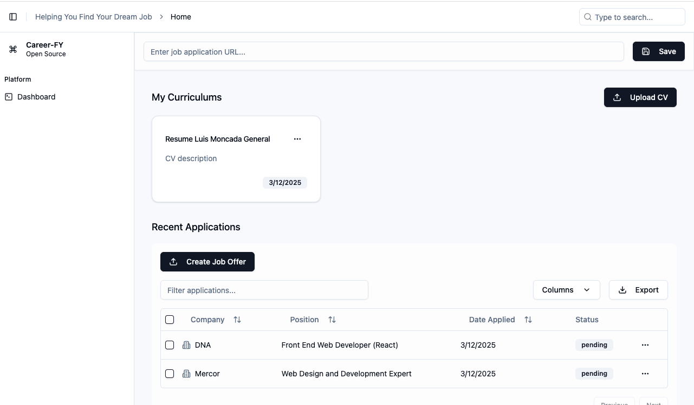
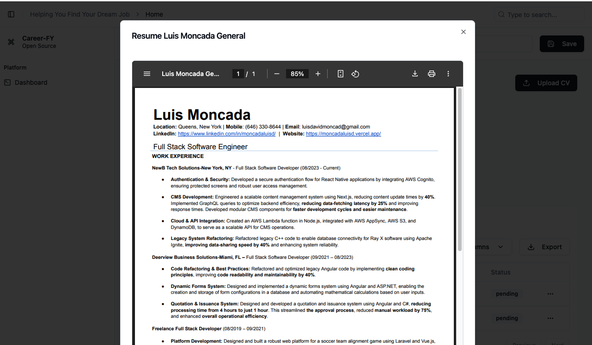
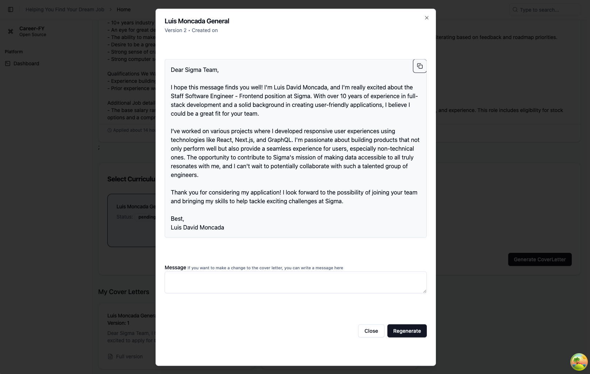

# Career-Fy

## Open-source platform to help you find a job

Career-Fy is a open-source platform to help you find a job.
I developed this as a side project to help me find a job and also to learn how to use AI.

## Features

- [X] Get description of a job by url
- [X] Upload multiple resumes
- [X] Create Cover Letter based on a resume and a job description
- [X] Create a job offer manual
- [X]  Suggestions to improve your resume
- [ ] Create a job alert
- [ ] Recomendations of jobs based on your curriculum
- [ ] Chat with a AI to help you find a job
- [ ] Get notified for new jobs based on your job alert

## Tech Stack

- [X] React
- [X] Tailwind CSS
- [X] TypeScript
- [X] Node.js
- [X] Express
- [X] MongoDB
- [X] OpenAI
- [X] Docker

## How to run

1. Clone the repository

2. Run `./install.sh` to install the dependencies

3. Go to the backend folder and clone the .env.example file to .env and set the environment variables

4. Go to the frontend folder and clone the .env.example file to .env and set the environment variables

5. Run `./dev.sh` to start the development servers

6. Optionally, run `./dev.sh --docker` to start the development servers in docker

## Screenshots

